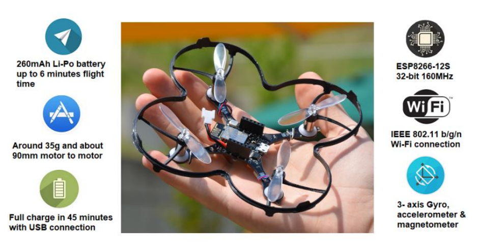
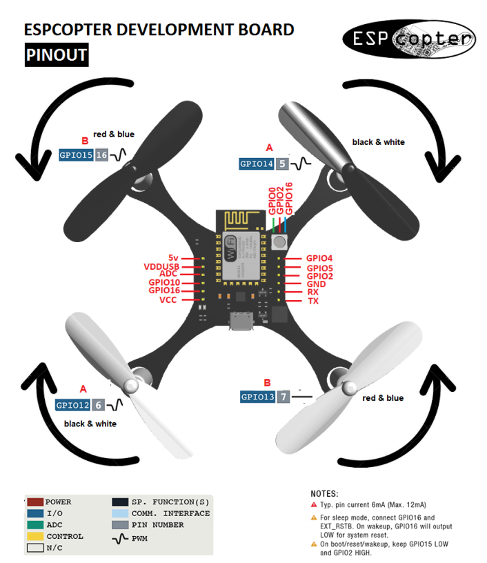

# A ROS package to communicate espcopters using wifi.

This repo contains the firmware of espcopter that enables this drone to communicate with ROS.







## How to build this firmare
- In construction...

## How to burn the pre-built bin file
```
$ /usr/local/bin/esptool.py -vv -cd nodemcu -cb 115200 -cp /dev/ttyUSB0 -ca 0x00000 -cf espcopter.ino.bin
```

## How to calibrate the drone
- In construction...


## More detail about ESPCopter
- Access here (https://espcopter.com/)

